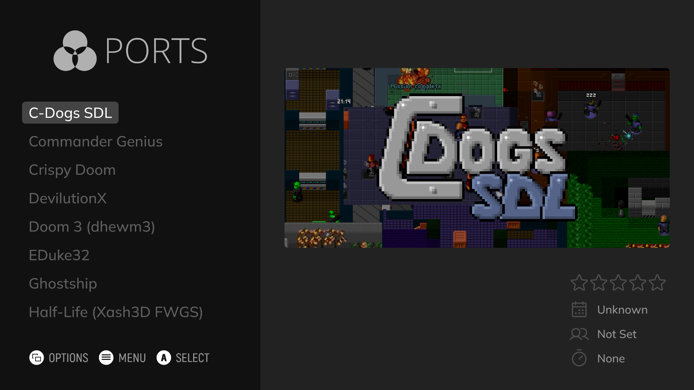

# Portable ES-DE for Linux

<p align="center">
<strong>A portable Linux retro gaming setup built around ES-DE, RetroArch, and standalone emulators. Includes curated AppImages, BIOS validation, and RetroBat import tooling for a clean, consistent, portable game library.</strong>
</p>

<p align="center">
<a href="https://es-de.org/"></a>
<a href="https://www.retroarch.com/"></a>


</p>



## Quick start

```bash
curl -LO https://raw.githubusercontent.com/flexcrush420/portable-esde-linux/main/setup-portable-esde.sh
chmod +x setup-portable-esde.sh
./setup-portable-esde.sh
```

Default install location:

```text
./ES-DE
```

Launch:

```bash
cd ./ES-DE
./launch.sh
```

Run a read only import audit:

```bash
./import-collection.sh --audit
```

## What this builds

| Layer | Included |
|---|---|
| Frontend | ES-DE in portable mode |
| Theme policy | Art Book Next by default. Nested hack and MSU systems for a tidy frontend. |
| Libretro | RetroArch AppImage plus curated `.so` cores |
| Standalone emulators | Dolphin, DuckStation, PCSX2, RPCS3, PPSSPP, Azahar, melonDS, Cemu, xemu, Xenia Canary, shadPS4, MAME, Supermodel, VPinball, and more |
| Ports and engines | Launchers inside `ROMs/ports`, backed by bundled AppImages in `Emulators/` |
| Importer | RetroBat and Batocera style collection importer with media, gamelist, BIOS, and nested system handling |
| Maintenance | Update script for emulator AppImages and RetroArch cores |

## Highlights

- Portable folder structure, no leaks, no global install required.
- ES-DE custom systems and find rules are generated automatically.
- Art Book Next is installed as the default theme.
- Unsupported standalone ports are grouped under `ports`, keeping theme art clean.
- RetroBat media folders are mapped to ES-DE media folders.
- Will import all Retrobat collections including Visual Pinball and PSN.
- Gamelists are merged and cleaned instead of blindly overwritten.
- BIOS files are routed to `ROMs/bios`, including BIOS files found beside ROMs.
- Generic BIOS archives are extracted into `ROMs/bios` without overwriting existing files.
- MSU and tidy nested systems are supported, including `snes-msu`, `msu-md`, `nes-msu`, and `neogeomvs`.
- Setup is rerun safe. User configs are preserved and managed generated files are backed up before replacement.

<details>
<summary><strong>Supported Systems</strong></summary>

| System | ES-DE Name | RetroBat Name |
|---|---|---|
| 3DO | 3do | 3do |
| Nintendo 3DS | 3ds | 3ds |
| Coleco Adam | adam | adam |
| Entex Adventure Vision | advision | advision |
| Commodore Amiga | amiga | amiga4000 |
| amigacdtv | amigacdtv | amigacdtv |
| Commodore Amiga 1200 | amiga1200 | amiga1200 |
| Commodore Amiga 500 | amiga500 | amiga500 |
| Amiga CD32 | amigacd32 | amigacd32 |
| Commodore CDTV | amigacdtv | amigacdtv |
| Amstrad CPC | amstradcpc | amstradcpc |
| gx4000 | gx4000 | gx4000 |
| APF Imagination Machine / M1000 | apfm1000 | apfm1000 |
| Apple II | apple2 | apple2 |
| Apple IIGS | apple2gs | apple2gs |
| Mattel Aquarius | aquarius | aquarius |
| Arcade | arcade | cave |
| gaelco | gaelco | gaelco |
| Arcadia 2001 | arcadia | arcadia |
| Acorn Archimedes | archimedes | archimedes |
| Arduboy | arduboy | arduboy |
| Bally Astrocade | astrocade | astrocade |
| Atari 2600 | atari2600 | atari2600 |
| Atari 5200 | atari5200 | atari5200 |
| Atari 7800 | atari7800 | atari7800 |
| Atari 800 | atari800 | atari800 |
| Atari Jaguar | atarijaguar | jaguar |
| Atari Jaguar CD | atarijaguarcd | jaguarcd |
| Atari Lynx | atarilynx | lynx |
| Atari ST | atarist | atarist |
| Acorn ATOM | atom | atom |
| Sammy Atomiswave | atomiswave | atomiswave |
| Acorn Computers BBC Micro | bbcmicro | bbcmicro |
| Elektronica BK | bk | bk |
| Commodore 128 | c128 | c128 |
| Commodore 64 | c64 | c64 |
| Cassette Vision | cassettevision | cassettevision |
| Cavestory | cavestory | cavestory |
| C-Dogs SDL | cdogs | cdogs |
| Commander Genius | cgenius | cgenius |
| Fairchild Channel F | channelf | channelf |
| TRS-80 Color Computer | coco | coco |
| ColecoVision | colecovision | colecovision |
| Capcom Play System I | cps1 | cps1 |
| Capcom Play System II | cps2 | cps2 |
| Capcom Play System III | cps3 | cps3 |
| DICE | dice | dice |
| DOS | dos | dos |
| Dragon Data Dragon 32 | dragon32 | dragon32 |
| Dreamcast | dreamcast | dreamcast |
| EasyRPG | easyrpg | easyrpg |
| Acorn Electron | electron | electron |
| Enterprise 64/128 | enterprise | enterprise |
| Nintendo Famicom | famicom | famicom |
| FinalBurn Neo | fbneo | fbneo |
| Famicom Disk System | fds | fds |
| Fujitsu FM-7 | fm7 | fm7 |
| Adobe Flash | flash | flash |
| FM Towns | fmtowns | fmtowns |
| Bit Corporation Gamate | gamate | gamate |
| Tiger Game.com | gamecom | gamecom |
| Game Gear | gamegear | gamegear |
| Epoch Game Pocket Computer | gamepock | gamepock |
| Game Boy | gb | gb |
| gb2players | gb2players | gb2players |
| Game Boy Advance | gba | gba |
| Game Boy Advance (Hacks & Homebrew) | gbah | gbah |
| Game Boy Color | gbc | gbc |
| gbc2players | gbc2players | gbc2players |
| Game Boy Color (Hacks & Homebrew) | gbch | gbch |
| Game Boy (Hacks & Homebrew) | gbh | gbh |
| Nintendo GameCube | gc | gamecube |
| Sega Genesis / Mega Drive | genesis | genesis |
| Sega Genesis (Hacks & Homebrew) | genh | genh |
| Sega Gear (Hacks & Homebrew) | ggh | ggh |
| Hartung Game Master | gmaster | gmaster |
| Game Park 32 | gp32 | gp32 |
| Amstrad GX4000 | gx4000 | gx4000 |
| Doom source ports | gzdoom | gzdoom |
| Mattel Intellivision | intellivision | intellivision |
| LCD Games | lcdgames | lcdgames |
| Casio Loopy | loopy | loopy |
| Lowres NX | lowresnx | lowresnx |
| Lutro Lua Framework | lutro | lutro |
| Atari Lynx | lynx | lynx |
| MAME | mame | hbmame |
| Master System / Mark III | markiii | markiii |
| Sega Mark III | mastersystem | mastersystem |
| Mega CD | megacd | megacd |
| Sega Mega Drive | megadrive | megadrive |
| megadrive-msu | megadrive-msu | megadrive-msu |
| Sega Mega Drive (Japan) | megadrivejp | megadrivejp |
| Mega Duck | megaduck | megaduck |
| Sega Model 2 | model2 | model2 |
| Sega Model 3 | model3 | model3 |
| Sega Mega Drive (MSU-MD) | msu-md | msu-md |
| MSX | msx | msx1 |
| MSX1 | msx1 | msx1 |
| MSX2 | msx2 | msx2 |
| MSX Turbo R | msxturbor | msxturbor |
| Tsukuda Othello Multivision | multivision | multivision |
| Nintendo 3DS | n3ds | 3ds |
| Nintendo 64 | n64 | n64 |
| Nintendo 64DD | n64dd | n64dd |
| Nintendo 64 (Hacks & Homebrew) | n64h | n64h |
| Sega NAOMI | naomi | naomi |
| Sega NAOMI 2 | naomi2 | naomi2 |
| Nintendo DS | nds | nds |
| Neo Geo | neogeo | neogeo |
| SNK Neo Geo CD | neogeocd | neogeocd |
| Nintendo Entertainment System | nes | nes |
| Nintendo Entertainment System (ProjectNested MSU-1) | nes-msu | nes-msu |
| Nintendo Entertainment System (Hacks & Homebrew) | nesh | nesh |
| Nokia N-Gage | ngage | ngage |
| Neo Geo Pocket | ngp | ngp |
| Neo Geo Pocket Color | ngpc | ngpc |
| Odyssey 2 / Videopac | odyssey2 | odyssey2 |
| OpenRA | openra | openra |
| OpenTyrian 2000 | opentyrian | opentyrian |
| Philips P2000T | p2000t | p2000t |
| PC-8800 | pc88 | pc88 |
| NEC PC-9800 | pc98 | pc98 |
| PC Engine | pcengine | pcengine |
| PC Engine CD | pcenginecd | pcenginecd |
| PC-FX | pcfx | pcfx |
| Aamber Pegasus | pegasus | pegasus |
| Commodore PET | pet | pet |
| Sega Pico | pico | pico |
| Commodore Plus/4 | plus4 | cplus4 |
| Pokemon Mini | pokemini | pokemini |
| Ports | ports | ports |
| PrBoom | prboom | prboom |
| Sony PlayStation 2 | ps2 | ps2 |
| Sony PlayStation 3 | ps3 | ps3 |
| PlayStation 3 (PSN / Digital) | ps3psn | psn |
| Sony PlayStation 4 | ps4 | ps4 |
| PlayStation Portable | psp | psp |
| Sony PlayStation | psx | psx |
| Casio PV-1000 | pv1000 | pv1000 |
| MGT SAM Coupé | samcoupe | samcoupe |
| Satellaview | satellaview | satellaview |
| Sega Saturn | saturn | saturn |
| Sega Saturn (Japan) | saturnjp | saturnjp |
| ScummVM | scummvm | scummvm |
| Epoch Super Cassette Vision | scv | scv |
| Sega 32X | sega32x | sega32x |
| Sega CD | segacd | segacd |
| Super Famicom | sfc | sfc |
| Sega SG-1000 | sg-1000 | multivision |
| Nintendo Super Game Boy | sgb | sgb |
| Super Nintendo Entertainment System | snes | snes |
| Super Nintendo (MSU-1) | snes-msu | snes-msu |
| Super Nintendo (Hacks & Homebrew) | snesh | snesh |
| VTech Socrates | socrates | socrates |
| Solarus | solarus | solarus |
| Spectravideo | spectravideo | spectravideo |
| SNES Sufami Turbo | sufami | sufami |
| NEC SuperGrafx | supergrafx | supergrafx |
| Watara Supervision | supervision | supervision |
| Nintendo Switch | switch | switch |
| NEC TurboGrafx-CD | tg-cd | tg-cd |
| NEC TurboGrafx-16 | tg16 | tg16 |
| Thomson MO/TO | thomson | thomson |
| Texas Instruments TI-99/4A | ti99 | ti99 |
| TIC-80 | tic80 | tic80 |
| Tomy Tutor | tutor | tutor |
| Uzebox | uzebox | uzebox |
| Vectrex | vectrex | vectrex |
| VIC-20 | vic20 | c20 |
| Videopac / Odyssey 2 | videopac | videopac |
| Philips Videopac+ G7400 | videopacplus | videopacplus |
| Virtual Boy | virtualboy | virtualboy |
| Tandy VIS | vis | vis |
| Visual Pinball | vpinball | vpinball |
| VTech V.Smile | vsmile | vsmile |
| WASM-4 | wasm4 | wasm4 |
| Nintendo Wii | wii | wii |
| Nintendo Wii U | wiiu | wiiu |
| WiiWare | wiiware | wiiware |
| Microsoft Windows 9x | win98 | win98 |
| Microsoft Windows | windows | windows |
| WonderSwan | wonderswan | wonderswan |
| WonderSwan Color | wonderswancolor | wonderswancolor |
| Sharp X1 | x1 | x1 |
| Sharp X68000 | x68000 | x68000 |
| Xbox Live Arcade | xbla | xbla |
| Microsoft Xbox | xbox | xbox |
| Microsoft Xbox 360 | xbox360 | xbox360 |
| Sinclair ZX81 | zx81 | zx81 |
| Sinclair ZX Spectrum | zxspectrum | zxspectrum |

</details>

<details>
<summary><strong>Directory structure</strong></summary>

```text
ES-DE/
├── ES-DE_x64.AppImage
├── launch.sh
├── update.sh
├── import-collection.sh
├── fetch-vpx-patches.sh
├── ES-DE/
│   ├── custom_systems/
│   ├── settings/
│   ├── gamelists/
│   └── themes/
├── Emulators/
│   ├── RetroArch*.AppImage
│   ├── retroarch-cores/
│   └── standalone emulator AppImages and wrappers
├── ROMs/
│   ├── bios/
│   ├── ports/
│   │   ├── OpenTyrian 2000.sh
│   │   └── other port launchers
│   ├── nes/
│   ├── snes/
│   ├── megadrive/
│   ├── psx/
│   └── one folder per supported system
├── downloaded_media/
└── Saves/
```

</details>

<details>
<summary><strong>Importing from RetroBat or Batocera style collections</strong></summary>

The importer can be run during setup or later:

```bash
./import-collection.sh
```

Read only audit mode:

```bash
./import-collection.sh --audit
```

The importer handles:

- ROM folder remaps, for example `neogeomvs` to `neogeo/neogeomvs`.
- MSU nesting, for example `snes-msu` to `snes/snes-msu`.
- ProjectNested NES-MSU as `ROMs/nes/nes-msu` with a custom `nes-msu` launcher using Snes9x.
- Port and engine folders routed under `ROMs/ports/<engine>` for theme safety.
- Media conversion from RetroBat folder names to ES-DE media folders.
- Gamelist path rewriting for nested folders.
- BIOS routing to `ROMs/bios`.
- Existing file protection.

</details>

<details>
<summary><strong>BIOS and firmware notes</strong></summary>

BIOS files are not included.

Common examples:

| System | Examples |
|---|---|
| PlayStation | `scph5500.bin`, `scph5501.bin`, `scph5502.bin` |
| PlayStation 2 | PCSX2 BIOS files |
| Dreamcast | `dc_boot.bin`, `dc_flash.bin` |
| Sega CD | `bios_CD_J.bin`, `bios_CD_U.bin`, `bios_CD_E.bin` |
| Neo Geo | `neogeo.zip` |
| PC Engine CD | `syscard3.pce` |

The importer checks BIOS status and routes recognised BIOS sidecars into `ROMs/bios`.

</details>

<details>
<summary><strong>Updating</strong></summary>

```bash
./update.sh
```

The update helper checks emulator AppImages and RetroArch cores. It keeps existing files unless you choose to replace them.

</details>

## Requirements

| Requirement | Notes |
|---|---|
| Linux | Tested target is Linux desktop, especially Mint/Ubuntu style systems |
| bash 4.0+ | Standard on most distributions |
| curl | Downloads release assets |
| python3 | Gamelist processing |
| unzip | Theme and archive extraction |
| Optional tools | `7z` and `unrar` improve BIOS and archive extraction |
| Free space | Roughly 15GB+ for emulator assets before ROMs/media |

Some AppImages may require `libfuse2` on certain distributions, although many newer PkgForge AppImages use runtimes that avoid that dependency.

## First run notes

Some emulators still need one time setup because firmware, keys, BIOS files, game data, or licensing cannot be bundled.

## Legal

This project downloads open source emulator software, source ports, and helper assets. It does not include commercial games, ROMs, BIOS files, firmware, keys, or copyrighted game data.

---

Made with ❤️ for the Linux retro gaming community
